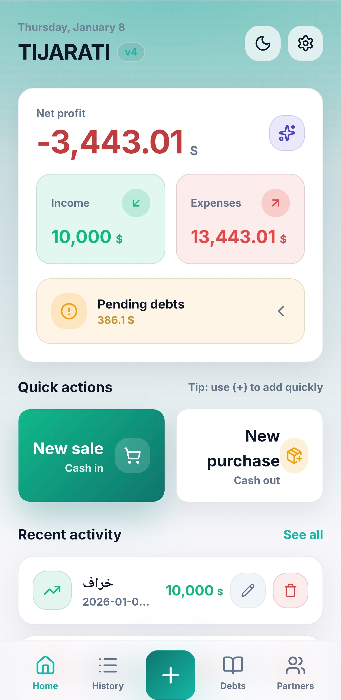
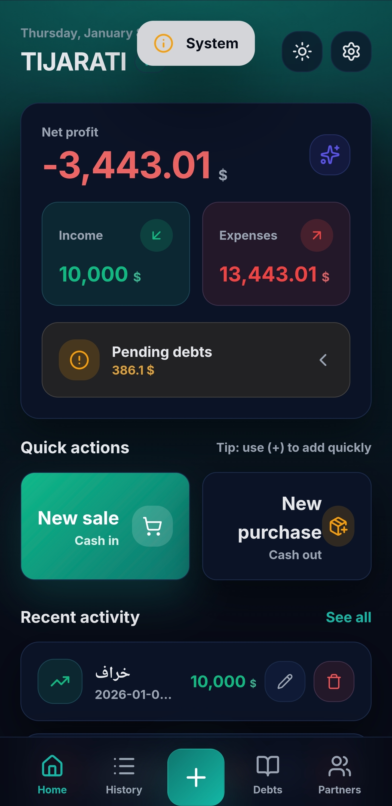
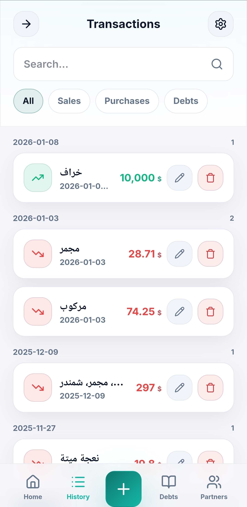
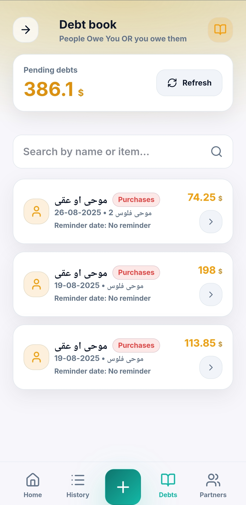
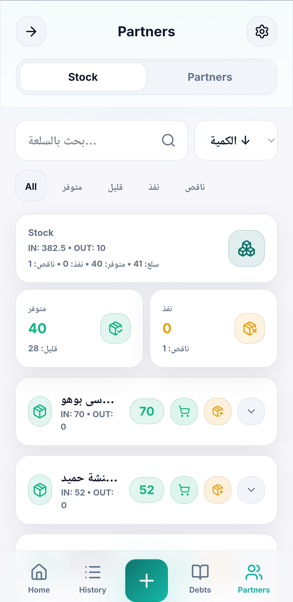
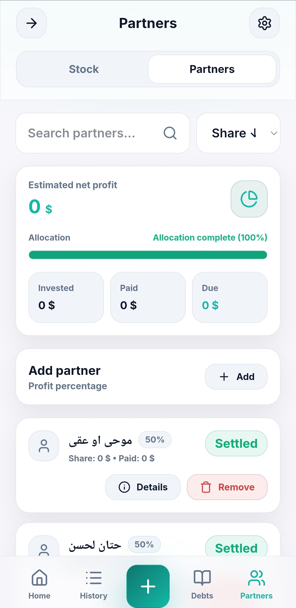
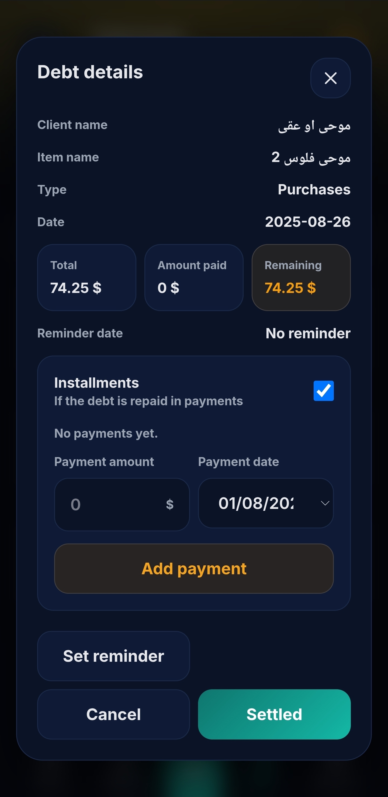
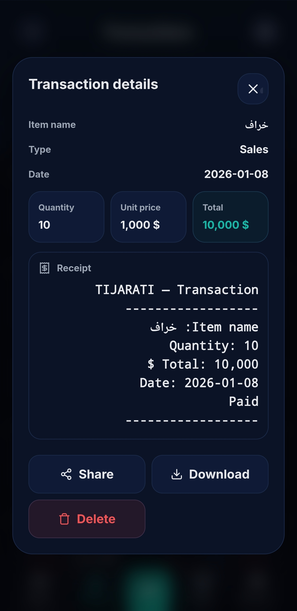
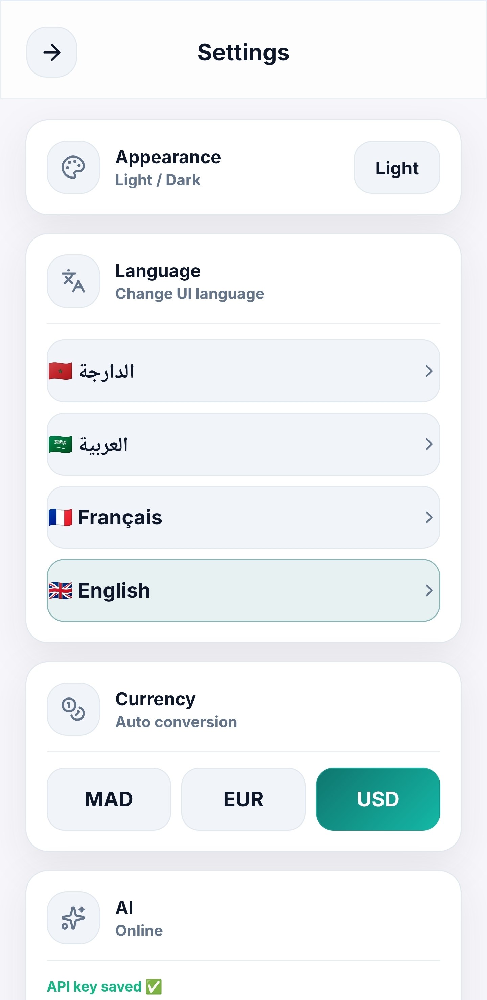

<p align="center">
  
</p>

<h1 align="center">Tijarati (تجارتي)</h1>

<p align="center">
  <strong>A premium, modern bookkeeping solution for small businesses and merchants.</strong>
</p>

---

## 🌟 Overview

**Tijarati** is a comprehensive bookkeeping application designed with a focus on speed, aesthetics, and ease of use. It bridges the gap between a powerful web interface and a seamless mobile experience using a React Native (Expo) wrapper. Whether you're tracking sales, managing stock, or splitting profits with partners, Tijarati provides all the tools you need in one elegant package.

## ✨ Key Features

- 💰 **Transaction Management**: Effortlessly record sales, purchases, and expenses.
- 📉 **Real-time Analytics**: Stay informed with net profit tracking and recent activity summaries.
- 🤝 **Partner Profit Split**: Manage multiple partners and automatically calculate profit allocations.
- 📦 **Stock Management**: Keep track of your inventory levels with smart alerts for low stock.
- 📖 **Debt Book**: A dedicated digital ledger to track who owes you and who you owe, with built-in installment tracking.
- 🌓 **Adaptive UI**: Beautifully crafted Light and Dark modes with glassmorphism effects.
- 🌍 **Multi-language Support**: Fully localized in **Darija, Arabic, French, and English**.
- 🤖 **AI Assistant**: Integrated AI (Gemini) to help you analyze your business data.
- ☁️ **Cloud Sync & Backup**: Securely backup your data to Firebase and sync across devices.

## 📸 Screenshots

### Dashboard & Analytics
<p align="center">
  
  
</p>

### Operations & Management
<p align="center">
  
  
  
</p>

### Advanced Features & Settings
<p align="center">
  
  
  
</p>
<p align="center">
  
</p>


---

## 🛠️ Tech Stack

- **Frontend**: Canonical Web UI (HTML/JS/CSS) with modern glassmorphism design.
- **Mobile**: React Native & Expo `WebView` shell.
- **Database**: Local SQLite (mobile) and Firebase for cloud backups.
- **Backend**: Node.js server (Firebase Functions).
- **AI**: Google Gemini API integration.

## 📁 Repository Structure

- `index.html` — The core Web UI (used by both mobile and web server).
- `mobile/` — Expo React Native application.
- `server/` — Node.js backend for AI endpoints and hosting.
- `screenshots/` — Project visual assets.
- `bundler.js` — Utility script to bundle the UI for mobile deployment.

---

## 🚀 Getting Started

### 1. Build the Mobile Bundle
The mobile app loads a generated bundle from the assets directory.
```bash
node bundler.js
```

### 2. Run the Web Server (Optional)
To use the UI in a browser or serve the AI API:
```bash
cd server
npm install
node server.js
```

### 3. Launch the Mobile App
Ensure you have the Expo Go app installed or an emulator ready.
```bash
cd mobile
npm install
npx expo start
```

---

## 🌐 AI Integration

Tijarati uses Gemini for intelligent business insights. You can configure it in two ways:
1. **Hosted Backend**: Deploy the `server/` directory and set `TIJARATI_AI_SERVER_URL`.
2. **Native Direct**: Set `TIJARATI_GEMINI_API_KEY` in your EAS build environment for direct native calls.

---

## 🌍 Localization

Tijarati is designed for the North African and Global market.
- **Languages**: 🇲🇦 Darija, 🇸🇦 Arabic, 🇫🇷 French, 🇬🇧 English.
- **Currency Support**: MAD, EUR, USD with auto-conversion capabilities.

---

<p align="center">
  Developed with ❤️ for merchants everywhere.
</p>
